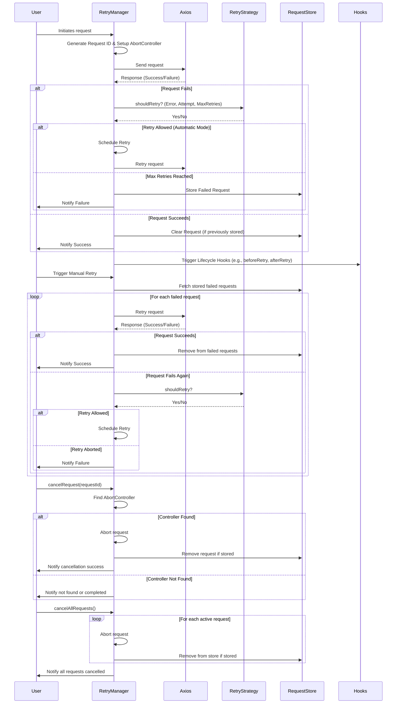

# axios-retryer

A powerful library that enables automatic **or** manual retries for Axios requests with rich configuration, concurrency controls, priority-based queuing, hooks, and custom strategies. Perfect for handling intermittent network issues or flaky endpoints without rewriting all your Axios logic.

## Table of Contents

1. [Installation](#installation)
2. [Features](#features)
3. [Comparison with Other Libraries](#comparison-with-other-libraries)
4. [Sequence Diagram](#sequence-diagram)
5. [Quick Example](#quick-example)
6. [Usage](#usage)
  1. [Creating a RetryManager](#creating-a-retrymanager)
  2. [Automatic vs. Manual Mode](#automatic-vs-manual-mode)
  3. [Retry Strategies](#retry-strategies)
  4. [Hooks (Lifecycle Events)](#hooks-lifecycle-events)
  5. [Canceling Requests](#canceling-requests)
  6. [Concurrency & Priority](#concurrency--priority)
  7. [Plugins](#plugins)
  8. [Debug Mode](#debug-mode)
7. [API Reference](#api-reference)
8. [Examples](#examples)
  1. [Automatic Retries with Default Strategy](#1-automatic-retries-with-default-strategy)
  2. [Manual Mode: Queue & Retry Later](#2-manual-mode-queue--retry-later)
  3. [Priority & Concurrency Example](#3-priority--concurrency-example)
9. [Contributing](#contributing)
10. [License](#license)

## Installation

```bash
npm install axios-retryer
```

Or:

```bash
yarn add axios-retryer
```

## Features

- **Automatic or Manual Retry Modes**: Configure 'automatic' to retry network/server errors based on a retry strategy, or 'manual' to queue failed requests and retry them later.
- **Advanced Concurrency & Priority**: Limit concurrent requests with maxConcurrentRequests and manage them via a priority-based queue. Higher-priority requests can block lower-priority ones using blockingQueueThreshold.
- **Configurable Retry Logic**: Provide your own RetryStrategy (e.g., exponential or custom backoff) or use the built-in defaults.
- **Request Store**: Failed requests are stored in an in-memory RequestStore by default (or use your own). This makes it easy to retry manually.
- **Hooks**: Tie into each stage (before retry, after retry, failure, all retries completed) for fine-grained control.
- **Plugin System**: Extend or modify behavior via simple plugin objects that can implement any of the lifecycle hooks.
- **Cancellation**: Cancel individual requests or all ongoing requests at once, leveraging AbortController.
- **Metrics**: Track total requests, failed retries, successful retries, cancellations, etc.
- **Debug Logging**: Optionally enable debug mode for detailed logs about the retry process.
- **TypeScript Support**: All types are included out of the box.

## Comparison with Other Libraries

| Feature | axios-retryer | axios-retry | retry-axios |
|---------|--------------|-------------|-------------|
| Automatic & Manual Modes | Yes. Either auto-retry or manually queue & retry (retryFailedRequests()). | Automatic only. | Automatic only. |
| Concurrency Control | Yes. maxConcurrentRequests + a priority-based queue. | No concurrency management. | No concurrency management. |
| Priority-Based Request Handling | Yes. (CRITICAL, HIGHEST, HIGH, MEDIUM, LOW) with a blockingQueueThreshold. | Not supported. | Not supported. |
| Customizable Retry Strategy | Yes. Provide a custom class implementing RetryStrategy. | Some built-in config. | Some built-in config. |
| Request Store / Manual Retry | Yes. Store failed requests in memory (or custom) and retry later. | No. | No. |
| Hooks & Plugin System | Yes. Lifecycle hooks (beforeRetry, afterRetry, etc.) plus plugin architecture. | Limited or no hooks. | Limited or no hooks. |
| Cancellation | Yes. Use cancelRequest/cancelAllRequests, internally uses AbortController. | Minimal or no direct support. | Minimal or no direct support. |
| Detailed Metrics & Debugging | Yes. Built-in metrics and optional debug logging. | Basic logging. | Basic logging. |
| TypeScript Support | Yes. Strong typings for hooks, config, strategies, etc. | Basic typings. | Basic typings. |

## Sequence Diagram



## Quick Example

```typescript
import { RetryManager } from 'axios-retryer';

const manager = new RetryManager({
  mode: 'automatic',
  retries: 3,
  debug: false, // Enable if you want verbose logs
});

manager.axiosInstance.get('https://jsonplaceholder.typicode.com/posts')
  .then((response) => {
    console.log('Received data:', response.data);
  })
  .catch((error) => {
    console.error('Request failed after all retries:', error);
  });
```

## Usage

### Creating a RetryManager

```typescript
import { RetryManager, RETRY_MODES, AXIOS_RETRYER_BACKOFF_TYPES, AXIOS_RETRYER_REQUEST_PRIORITIES } from 'axios-retryer';

const retryManager = new RetryManager({
  mode: RETRY_MODES.AUTOMATIC,
  retries: 2,
  throwErrorOnFailedRetries: true, // default
  throwErrorOnCancelRequest: true, // default
  debug: false,

  // Concurrency & Queue
  maxConcurrentRequests: 5,
  queueDelay: 100,
  blockingQueueThreshold: AXIOS_RETRYER_REQUEST_PRIORITIES.HIGHEST,

  // Retry strategy config
  retryableStatuses: [408, [500, 599]],
  retryableMethods: ['get', 'head', 'options'],
  backoffType: AXIOS_RETRYER_BACKOFF_TYPES.EXPONENTIAL,
});
```

#### Important Options
- `mode ('automatic' | 'manual')`: How the manager handles retries by default.
- `retries (number)`: Maximum number of auto-retries.
- `maxConcurrentRequests (number)`: Limits concurrent requests; others are queued.
- `queueDelay (number)`: A small delay before dequeuing requests (in ms).
- `blockingQueueThreshold (AxiosRetryerRequestPriority)`: Priority threshold above which lower-priority requests are blocked.
- `throwErrorOnFailedRetries`: Whether to throw an error after all retries fail (default true).
- `throwErrorOnCancelRequest`: Whether to throw an error if a request is canceled (default true).
- `debug`: Enable to get verbose logs.
- `retryableStatuses`, `retryableMethods`, `backoffType`: Configure how/when requests should retry.

You can pass your own AxiosInstance if you want to share interceptors or custom config:

```typescript
import axios from 'axios';

const customAxios = axios.create({ baseURL: 'https://api.example.com' });

const manager = new RetryManager({
  mode: 'automatic',
  axiosInstance: customAxios,
  // ...
});
```

### Automatic vs. Manual Mode

#### Automatic Mode
- Retries happen automatically based on the retryStrategy logic (default or custom).
- Once retries are exhausted for a request, it is stored in the RequestStore.
- You can still manually retry them later if you want (e.g., `manager.retryFailedRequests()`).

#### Manual Mode
- Each request is attempted only once initially.
- Any failed request is stored in the RequestStore.
- You can call `manager.retryFailedRequests()` to bulk-retry them at a later time (useful for offline scenarios or user-driven retrigger).

### Retry Strategies

By default, axios-retryer uses a DefaultRetryStrategy that treats network errors, 408, 429, and 5xx status codes as retryable, plus an exponential backoff.

You can implement the RetryStrategy interface to customize when or how to retry:

```typescript
import type { AxiosError } from 'axios';
import { RetryStrategy } from 'axios-retryer';

export class CustomRetryStrategy implements RetryStrategy {
  getIsRetryable(error: AxiosError): boolean {
    // Only retry 5xx errors or no response (network error)
    const status = error.response?.status;
    const isServerError = status && status >= 500 && status < 600;
    return !error.response || isServerError;
  }

  shouldRetry(error: AxiosError, attempt: number, maxRetries: number): boolean {
    return this.getIsRetryable(error) && attempt <= maxRetries;
  }

  getDelay(attempt: number): number {
    // Simple linear backoff (1s, 2s, etc.)
    return attempt * 1000;
  }
}
```

Use it like:

```typescript
const manager = new RetryManager({
  mode: 'automatic',
  retries: 3,
  retryStrategy: new CustomRetryStrategy(),
});
```

### Hooks (Lifecycle Events)

```typescript
const manager = new RetryManager({
  mode: 'automatic',
  hooks: {
    onRetryProcessStarted: () => console.log('Retry process started'),
    beforeRetry: (config) => {
      console.log('Will retry:', config.url);
    },
    afterRetry: (config, success) => {
      console.log(`Retried ${config.url}, Success? ${success}`);
    },
    onFailure: (config) => {
      console.log('Final failure for:', config.url);
    },
    onRetryProcessFinished: (metrics) => {
      console.log('All retry attempts done. Metrics:', metrics);
    },
  },
});
```

### Canceling Requests

Each request has a unique `__requestId`. You can cancel in-flight requests individually:

```typescript
manager.cancelRequest('my-request-id');
```

Or you can cancel all ongoing requests:

```typescript
manager.cancelAllRequests();
```

In both cases, aborted requests are counted as canceled in the built-in metrics.

### Concurrency & Priority

axios-retryer supports concurrency control (`maxConcurrentRequests`) and a priority-based queue.

- `maxConcurrentRequests`: The maximum number of requests processed at once.
- `blockingQueueThreshold`: If set, any request with priority >= threshold will block lower-priority requests until it finishes.

Priority constants:
- `AXIOS_RETRYER_REQUEST_PRIORITIES.CRITICAL = 4`
- `AXIOS_RETRYER_REQUEST_PRIORITIES.HIGHEST = 3`
- `AXIOS_RETRYER_REQUEST_PRIORITIES.HIGH = 2`
- `AXIOS_RETRYER_REQUEST_PRIORITIES.MEDIUM = 1`
- `AXIOS_RETRYER_REQUEST_PRIORITIES.LOW = 0`

To assign a priority, simply include `__priority` in your request config:

```typescript
manager.axiosInstance.get('/some-url', {
  __priority: 3, // 'HIGHEST'
});
```

### Plugins

Plugins let you extend axios-retryer without modifying core code. A plugin is an object with:

```typescript
{
  name: string;
  version: string;
  initialize: (manager: RetryManager) => {};
  hooks: RetryHooks;
}
```

- `initialize` is called when the plugin is registered, giving you access to the RetryManager.
- `hooks` can implement any of the same lifecycle hooks as the manager's hooks object.

Example:

```typescript
const LoggingPlugin = {
  name: 'LoggingPlugin',
  version: '1.0.0',
  initialize(manager) {
    console.log('LoggingPlugin initialized');
  },
  hooks: {
    afterRetry: (config, success) => {
      console.log(`Request ${config.url} retry result: ${success ? 'success' : 'failure'}`);
    }
  }
};

manager.use(LoggingPlugin);
```

You can list plugins with `manager.listPlugins()`.

### Debug Mode

Set `debug: true` in your RetryManagerOptions to enable verbose logging:

```typescript
const manager = new RetryManager({
  mode: 'automatic',
  retries: 2,
  debug: true,
});
```

## API Reference

### class RetryManager
- Constructor: `new RetryManager(options: RetryManagerOptions)`
- `axiosInstance`: Returns the wrapped Axios instance.
- `retryFailedRequests()`: Manually retry all requests stored as failed.
- `cancelRequest(requestId: string)`: Cancel a specific ongoing request.
- `cancelAllRequests()`: Cancel all ongoing requests.
- `use(plugin: RetryPlugin)`: Register a plugin.
- `listPlugins()`: Retrieve a list of registered plugins.
- `getMetrics()`: Returns `{ totalRequests, successfulRetries, failedRetries, completelyFailedRequests, canceledRequests }`.

### interface RetryManagerOptions
- `throwErrorOnCancelRequest? (boolean)`
- `debug? (boolean)`
- `retryableStatuses? ((number | [number, number])[])`
- `retryableMethods? (string[])`
- `backoffType? (AxiosRetryerBackoffType)`
- `maxRequestsToStore? (number)`
- `maxConcurrentRequests? (number)`
- `queueDelay? (number)`
- `blockingQueueThreshold? (AxiosRetryerRequestPriority)`

### interface RetryStrategy
- `getIsRetryable(error: AxiosError): boolean`
- `shouldRetry(error: AxiosError, attempt: number, maxRetries: number): boolean`
- `getDelay(attempt: number, maxRetries: number): number`

### interface RetryHooks
- `onRetryProcessStarted?(): void`
- `beforeRetry?(config: AxiosRetryerRequestConfig): void`
- `afterRetry?(config: AxiosRetryerRequestConfig, success: boolean): void`
- `onFailure?(config: AxiosRetryerRequestConfig): void`
- `onRetryProcessFinished?(metrics: AxiosRetryerMetrics): void`
- `onCriticalRequestFailed?(): void`
- `onRequestRemovedFromStore?(request: AxiosRetryerRequestConfig): void`

## Examples

### 1. Automatic Retries with Default Strategy

```typescript
import { RetryManager } from 'axios-retryer';

const manager = new RetryManager({
  mode: 'automatic',
  retries: 3,
});

manager.axiosInstance.get('https://httpbin.org/status/500')
  .then(response => console.log('Success:', response.data))
  .catch(error => console.error('Request failed after 3 retries:', error));
```

### 2. Manual Mode: Queue & Retry Later

```typescript
import { RetryManager, RETRY_MODES } from 'axios-retryer';

const manager = new RetryManager({
  mode: RETRY_MODES.MANUAL,
  retries: 2,
});

// Initial request fails, then we'll retry later
manager.axiosInstance.get('https://httpbin.org/status/500')
  .catch(error => {
    console.error('Initial request failed:', error);
  });

// At some point in the future...
manager.retryFailedRequests().then((responses) => {
  console.log('Retried responses:', responses);
}).catch(err => {
  console.error('Error retrying failed requests:', err);
});
```

### 3. Priority & Concurrency Example

```typescript
import { RetryManager, AXIOS_RETRYER_REQUEST_PRIORITIES } from 'axios-retryer';

const manager = new RetryManager({
  mode: 'automatic',
  maxConcurrentRequests: 2,
  blockingQueueThreshold: AXIOS_RETRYER_REQUEST_PRIORITIES.HIGHEST,
  debug: true,
});

const axiosInstance = manager.axiosInstance;

// High priority
axiosInstance({
  url: 'https://example.com/api/high',
  method: 'GET',
  __priority: AXIOS_RETRYER_REQUEST_PRIORITIES.HIGHEST,
})
  .then(() => console.log('High priority request succeeded'))
  .catch(() => console.log('High priority request failed'));

// Low priority
axiosInstance({
  url: 'https://example.com/api/low',
  method: 'GET',
  __priority: AXIOS_RETRYER_REQUEST_PRIORITIES.LOW,
})
  .then(() => console.log('Low priority request succeeded'))
  .catch(() => console.log('Low priority request failed'));
```

## Contributing

Contributions, issues, and feature requests are welcome! Please see the Contributing guidelines for more details. Feel free to open issues if you have questions or suggestions.

## License

This project is licensed under the MIT License.

Enjoy more reliable Axios requests with axios-retryer!