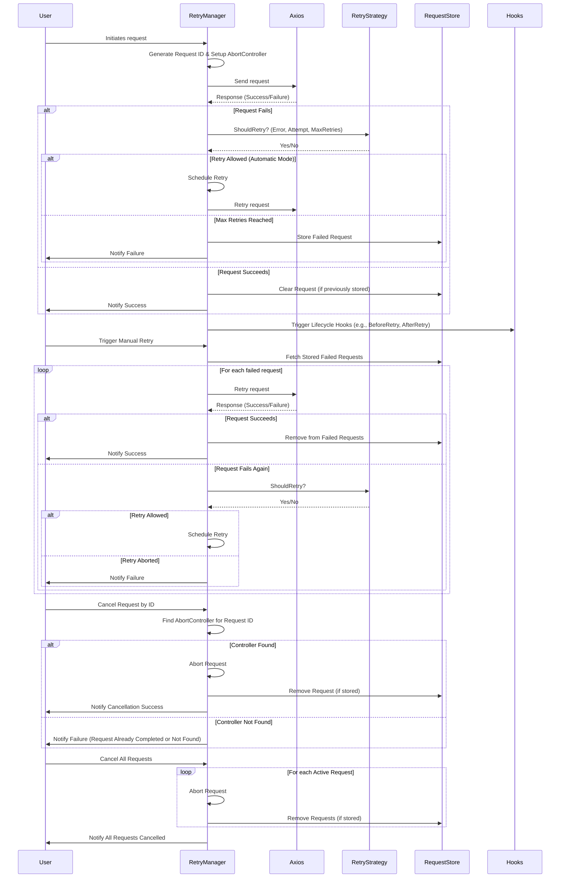

# axios-retryer

A powerful library that enables automatic or manual retries for Axios requests with rich configuration, hooks, and custom strategies. Perfect for handling intermittent network issues or flaky endpoints without rewriting all your Axios logic.

## Table of Contents

- [Installation](#installation)
- [Features](#features)
- [Quick Example](#quick-example)
- [Usage](#usage)
    - [Creating a RetryManager](#creating-a-retrymanager)
    - [Automatic vs. Manual Mode](#automatic-vs-manual-mode)
    - [Retry Strategies](#retry-strategies)
    - [Hooks (Lifecycle Events)](#hooks-lifecycle-events)
    - [Canceling Requests](#canceling-requests)
    - [Debug Mode](#debug-mode)
- [API Reference](#api-reference)
- [Examples](#examples)
    - [Automatic Retries with Default Strategy](#1-automatic-retries-with-default-strategy)
    - [Manual Mode: Queue & Retry Later](#2-manual-mode-queue--retry-later)
- [Contributing](#contributing)
- [License](#license)

## Installation

```bash
npm install axios-retryer
```

or

```bash
yarn add axios-retryer
```

## Features

- **Automatic or/and Manual Retry Modes**: Choose 'automatic' to retry network/server errors automatically or 'manual' to queue failed requests for later retry.
- **Configurable Retry Logic**: Provide your own RetryStrategy or use the built-in one.
- **Request Store**: Failed requests are stored in an `InMemoryRequestStore`, which keeps requests in memory for quick access and retries.
- **Hooks**: Tie into each stage (before retry, after retry, failure, all retries completed).
- **Cancellation**: Cancel individual requests or all ongoing requests at once.
- **TypeScript Support**: All types are included out of the box.

### Why Choose `axios-retryer`?

When compared to alternatives, `axios-retryer` stands out with its advanced features and flexibility:

| Feature                      | `axios-retryer`                                                                      | `axios-retry`                                              | `retry-axios`                                               |
|-----------------------------|--------------------------------------------------------------------------------------|------------------------------------------------------------|-------------------------------------------------------------|
| **Automatic vs. Manual**    | ✅ Supports both (configurable via `mode` + manual calls like `retryFailedRequests()`) | ✅ Automatic only                                          | ✅ Automatic only                                           |
| **Request Cancellation**    | ✅ Full support for aborting in-flight requests via `AbortController`                 | ❌ Limited / no direct support                             | ❌ Limited / no direct support                              |
| **Custom Plugins**          | ✅ Extend functionality via custom plugins (e.g., hooks, version checks)              | ❌ Not supported                                           | ❌ Not supported                                            |
| **Request Store Options**   | ✅ In-memory request stores                                                           | ❌ No concept of storing failed requests                   | ❌ No concept of storing failed requests                    |
| **Hook-Based Control**      | ✅ Detailed lifecycle hooks (`beforeRetry`, `afterRetry`, `onFailure`, etc.)          | ❌ Basic or no hooks                                       | ❌ Basic or no hooks                                        |
| **Metrics**                 | ✅ Built-in metrics (total requests, successful retries, failed retries, etc.)        | ❌ No built-in metrics                                     | ❌ No built-in metrics                                      |
| **TypeScript Support**      | ✅ Fully typed, leverages generics in config and interceptors                         | ✅ Partial / basic typings                                 | ✅ Partial / basic typings                                  |
| **Debugging / Logging**     | ✅ Integrated debug logs (via internal `RetryLogger`)                                 | ❌ Minimal logging                                         | ❌ Minimal logging                                          |
| **Backoff / Delay Strategy**| ✅ Pluggable via `RetryStrategy` (e.g., exponential, linear, custom)                  | ✅ Built-in exponential backoff (configurable)            | ✅ Built-in exponential backoff (via `RAXOptions`)          |

## Sequence Diagram



## Quick Example

Here is a short snippet showing how to instantiate the `RetryManager` for automatic retries:

```typescript
import { RetryManager } from 'axios-retryer';

const manager = new RetryManager({
  mode: 'automatic',
  retries: 3,
  throwErrorOnFailedRetries: true, // (default=true) Throw error if all retries fail
});

// Use the internal Axios instance to make requests
manager.getAxiosInstance().get('https://jsonplaceholder.typicode.com/posts')
  .then((response) => {
    console.log('Received data:', response.data);
  })
  .catch((error) => {
    console.error('Request failed after all retries:', error);
  });
```

## Usage

### Creating a RetryManager

```typescript
import { RetryManager } from 'axios-retryer';

const retryManager = new RetryManager({
  mode: 'automatic',
  retries: 2,
  throwErrorOnFailedRetries: true, // (default=true)
  throwErrorOnCancelRequest: true, // (default=true)
  // You can also pass hooks, custom strategy, request store, or debug flag
});
```

Available options (`RetryManagerOptions`):

- `mode` (`'automatic' | 'manual'`): Determines how retries occur. Use `RETRY_MODES.AUTOMATIC` for automatic retries or `RETRY_MODES.MANUAL` for manual handling.
- `retries?` (`number`, default: `3`): Max number of retry attempts for automatic mode.
- `retryStrategy?` (`RetryStrategy`): Custom logic for deciding if and when to retry.
- `requestStore?` (`RequestStore`): Where failed requests are stored; defaults to an in-memory store.
- `hooks?` (`RetryHooks`): Lifecycle hooks (e.g., `beforeRetry`, `afterRetry`, `onFailure`, `onAllRetriesCompleted`).
- `axiosInstance?` (`AxiosInstance`): Provide a pre-configured Axios instance; otherwise, a new one is created.
- `throwErrorOnFailedRetries?` (`boolean`, default: `true`): Whether to throw an error after all retries fail.
- `throwErrorOnCancelRequest?` (`boolean`, default: `true`): Whether to throw if a request is canceled.
- `debug?` (`boolean`, default: `false`): If true, logs debug messages about the retry process.

### Automatic vs. Manual Mode

#### Automatic (`mode: 'automatic'`):

- Requests are retried automatically according to your chosen `retryStrategy` and `retries` count.
- Once retries are exhausted, the request is stored in the `requestStore`.
- You can then manually retry them later with `.retryFailedRequests()` if desired.

#### Manual (`mode: 'manual'`):

- Requests are not retried automatically.
- Once a request fails, it’s stored in the `requestStore`.
- You can later call `.retryFailedRequests()` to attempt them again in bulk.

### Retry Strategies

By default, `axios-retryer` uses a `DefaultRetryStrategy`:

```typescript
export class DefaultRetryStrategy implements RetryStrategy {
  constructor(
          private readonly retryableStatuses: (number | [number, number])[] = [408, 429, 500, 502, 503, 504],
          private readonly retryableMethods: string[] = ['get', 'head', 'options', 'put'],
          private readonly backoffType: AxiosRetryerBackoffType = AXIOS_RETRYER_BACKOFF_TYPES.EXPONENTIAL,
  ) {}

  public getIsRetryable(error: AxiosError): boolean {
    // Network errors
    if (!error.response) {
      return true;
    }

    const method = error.config?.method?.toLowerCase();
    const status = error.response.status;

    if (
            method &&
            this.retryableMethods.indexOf(method) !== -1 &&
            status &&
            isInRangeOrExact(status, this.retryableStatuses)
    ) {
      return true;
    }

    // Special case for POST - check idempotency header
    if (method === 'post' && error.config?.headers?.['Idempotency-Key']) {
      return true;
    }

    return false;
  }

  public shouldRetry(error: AxiosError, attempt: number, maxRetries: number): boolean {
    return this.getIsRetryable(error) && attempt <= maxRetries;
  }

  public getDelay(attempt: number) {
    return getBackoffDelay(attempt, this.backoffType);
  }
}

```

If you want custom logic, just implement the `RetryStrategy` interface:

```typescript
import { RetryStrategy } from 'axios-retryer';
import type { AxiosError } from 'axios';

export class CustomRetryStrategy implements RetryStrategy {
  constructor(
    private readonly retryableStatuses: (number | [number, number])[],
    private readonly retryableMethods: string[],
    private readonly backoffType: AxiosRetryerBackoffType,
  ) {}
  
  getIsRetryable(error: AxiosError): boolean {
    const isNetworkError = !error.response;
    const isServerError = error.response && error.response.status >= 500 && error.response.status < 600;
    return (isNetworkError || isServerError) || false;
  }

  shouldRetry(error: AxiosError, attempt: number, maxRetries: number): boolean {
    return (this.getIsRetryable(error) && attempt <= maxRetries);
  }

  getDelay(attempt: number) {
    return 1000; // Linear backoff: 1s
  }
}

const manager = new RetryManager({
  mode: 'automatic',
  retries: 3,
  retryStrategy: new CustomRetryStrategy(),
});
```

### Hooks (Lifecycle Events)

You can subscribe to hooks that provide additional control over or insight into the retry flow:

```typescript
const retryManager = new RetryManager({
  mode: 'automatic',
  hooks: {
    beforeRetry: (config) => {
      console.log('Will retry this config:', config.url);
    },
    afterRetry: (config, success) => {
      console.log(`Attempt finished for ${config.url}. Success? ${success}`);
    },
    onFailure: (config) => {
      console.log(`Request has finally failed: ${config.url}`);
    },
    onRetryProcessStarted: () => {
      console.log(`Retry process started`);
    },
    onRetryProcessFinished: (failedRequests) => {
      console.log(`All retries completed. ${failedRequests} request(s) failed in total.`);
    },
  },
});
```

### Canceling Requests

Each request is assigned an internal `requestId`. You can cancel them either individually or all at once:

```typescript
const manager = new RetryManager({ mode: 'automatic' });
const axiosInstance = manager.getAxiosInstance();

axiosInstance.get('https://example.com/slow-endpoint')
  .catch(err => {
    if (err.message.includes('aborted')) {
      console.log('This request was canceled');
    }
  });

// Later, if we want to cancel all ongoing requests:
manager.cancelAllRequests();
```

You can also call `cancelRequest(requestId)` if you happen to know the exact `requestId`.

### Debug Mode

Set `debug: true` in the `RetryManagerOptions` to log detailed messages about retries, failures, store operations, etc. This can help troubleshoot issues during development.

```typescript
const manager = new RetryManager({
  mode: 'automatic',
  retries: 2,
  debug: true,
});
```

## API Reference

### RetryManager

- `constructor(options: RetryManagerOptions)`
- `.getAxiosInstance()`: Returns the underlying Axios instance.
- `.retryFailedRequests()`: Manually retry all stored (failed) requests.
- `.cancelRequest(requestId: string)`: Cancel a specific in-progress request.
- `.cancelAllRequests()`: Cancel all in-progress requests.
- `.use()`: Add a new plugin
- `.listPlugins()`: List all attached plugin names

### RequestStore

- `.add(request: AxiosRetryerRequestConfig)`
- `.remove(request: AxiosRetryerRequestConfig)`
- `.getAll()`
- `.clear()`

### RetryStrategy

- `.getIsRetryable(error: AxiosError): boolean`
- `.shouldRetry(error: AxiosError, attempt: number, maxRetries: number): boolean`
- `.getDelay(attempt: number, maxRetries: number): number`

For a complete list of all exported types and classes, see the source code or your IDE’s intellisense (if using TypeScript).

## Examples

### 1. Automatic Retries with Default Strategy

```typescript
import { RetryManager } from 'axios-retryer';

const manager = new RetryManager({
  mode: 'automatic',
  retries: 3,
});

manager.getAxiosInstance().get('https://httpbin.org/status/500')
  .then(response => console.log('Response:', response.data))
  .catch(error => console.error('Request failed after 3 retries:', error));
```

### 2. Manual Mode: Queue & Retry Later

```typescript
import { RetryManager } from 'axios-retryer';

const manager = new RetryManager({
  mode: 'manual',
  retries: 2,
});

manager.getAxiosInstance().get('https://httpbin.org/status/500')
  .catch(error => {
    console.error('Initial request failed:', error);
  });

manager.retryFailedRequests().then((responses) => {
  console.log('Retried responses:', responses);
}).catch(err => {
  console.error('Error retrying all failed requests:', err);
});
```

The `RetryManager` library supports plugins to extend its functionality dynamically. Plugins can hook into the retry lifecycle and perform custom logic such as logging, metrics tracking, request tagging, and more.

---

## Plugin Examples

### **1. Logging Plugin**

Logs retry events for debugging purposes.

```typescript
const LoggingPlugin = {
  name: 'LoggingPlugin',
  version: '1.0.0',
  initialize(manager) {
    console.log('LoggingPlugin initialized');
  },
  hooks: {
    beforeRetry: (config) => {
      console.log(`Retrying request to: ${config.url}`);
    },
    afterRetry: (config, success) => {
      console.log(`Retry ${success ? 'succeeded' : 'failed'} for request: ${config.url}`);
    },
    onFailure: (config) => {
      console.log(`Request permanently failed: ${config.url}`);
    },
  },
};

retryManager.use(LoggingPlugin);
```
---

### **2. Metrics Plugin**

Tracks the total number of retries and logs the count after retries are exhausted.

```typescript
const MetricsPlugin = {
  name: 'MetricsPlugin',
  version: '1.0.0',
  initialize(manager) {
    let retryCount = 0; // Use closure for state management

    this.hooks = {
      beforeRetry: () => {
        retryCount++;
      },
      onFailure: () => {
        console.log(`Total retries attempted: ${retryCount}`);
      },
      onRetryProcessFinished: () => {
        console.log(manager.getMetrics());
      }
    };
  },
};

retryManager.use(MetricsPlugin);
```

### **3. Request Tagging Plugin**

Adds a custom tag to the request headers for tracking retries.

```typescript
const RequestTaggingPlugin = {
  name: 'RequestTaggingPlugin',
  version: '1.0.0',
  initialize(manager) {
    this.hooks = {
      beforeRetry: (config) => {
        config.headers = config.headers || {};
        config.headers['X-Retry-Tag'] = `Retry-Attempt-${config.__retryAttempt}`;
        console.log(`Added retry tag: ${config.headers['X-Retry-Tag']}`);
      },
    };
  },
};

retryManager.use(RequestTaggingPlugin);
```

---

### **4. Analytics Plugin**

Logs retry metrics to an external analytics service.

```typescript
const AnalyticsPlugin = {
  name: 'AnalyticsPlugin',
  version: '1.0.0',
  initialize(manager) {
    const analyticsService = {
      logEvent: (event, data) => {
        console.log(`Analytics event: ${event}`, data);
      },
    };

    this.hooks = {
      beforeRetry: (config) => {
        analyticsService.logEvent('RetryScheduled', {
          url: config.url,
          attempt: config.__retryAttempt,
        });
      },
      afterRetry: (config, success) => {
        analyticsService.logEvent('RetryResult', {
          url: config.url,
          success,
        });
      },
    };
  },
};

retryManager.use(AnalyticsPlugin);
```
## Adding Plugins to Your `RetryManager`

To use any of these plugins, register them with the `RetryManager`:

```typescript
const retryManager = new RetryManager({ mode: 'automatic', retries: 3 });

// Register plugins
retryManager.use(LoggingPlugin);
retryManager.use(MetricsPlugin);
retryManager.use(RequestTaggingPlugin);
```

## Contributing

Contributions, issues, and feature requests are welcome. Please see the [Contributing](./CONTRIBUTING.md) guidelines for more details! 
Feel free to check the issues page if you have any questions or suggestions.


## License

This project is licensed under the MIT License.

Enjoy reliable Axios requests with `axios-retryer`!
